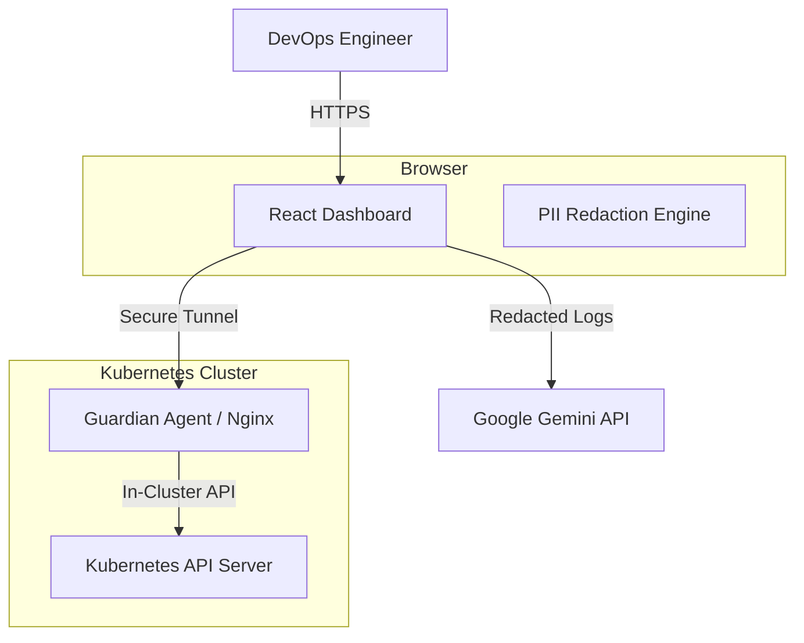

# Kube-Guardian


**The Enterprise-Grade AI SRE Agent for Kubernetes**

Kube-Guardian is a next-generation observability and remediation platform designed for Day 2 Operations. It leverages **Google Gemini models** to provide autonomous Root Cause Analysis (RCA), PII redaction, and self-healing capabilities for multi-cloud Kubernetes clusters (AWS, GCP, Azure).

---

## 🚀 Features

### 🧠 Neural Analysis Engine
*   **Automated RCA**: Instantly diagnoses `CrashLoopBackOff`, `OOMKilled`, and `ImagePullBackOff` errors.
*   **Contextual Awareness**: Correlates pod logs with YAML manifests to find configuration drift.
*   **Remediation Patching**: Generates ready-to-apply YAML fixes with a confidence score.

### 🛡️ Zero-Trust Security
*   **Client-Side Redaction**: Sensitive data (IPs, Emails, AWS Keys) is masked *before* leaving the browser.
*   **Secure Gateway**: Connects to clusters via a read-only Nginx reverse proxy with TLS termination.
*   **Audit Logging**: Immutable record of all AI analysis and remediation attempts.

### 🌐 Multi-Cloud Topology
*   **Unified Glass**: Single pane of glass for clusters across AWS Sydney, GCP Melbourne, and Azure Canberra.
*   **Network Mapping**: Visual topology of node distribution and region latency.

---

## 🏗️ Architecture



---

## 🛠️ Getting Started

### Prerequisites
*   Node.js 18+
*   Google Gemini API Key
*   Kubernetes Cluster (Minikube, EKS, GKE, or AKS)

### Installation

1.  **Clone the Repository**
    ```bash
    git clone https://github.com/kubeguardian/console.git
    cd console
    ```

2.  **Install Dependencies**
    ```bash
    npm install
    ```

3.  **Configure Environment**
    Copy the example environment file and add your API key.
    ```bash
    cp .env.example .env
    # Edit .env and set API_KEY=your_gemini_key
    ```

4.  **Run Development Server**
    ```bash
    npm run dev
    ```

---

## 🔌 Connecting a Cluster

Kube-Guardian uses a **Secure Gateway Agent** model. To connect your cluster:

1.  Click **"Connect Node"** in the Dashboard top-right corner.
2.  Enter your DNS Domain (e.g., `guardian.corp.com`).
3.  The dashboard will generate a Kubernetes Manifest (`guardian.yaml`).
4.  Apply the manifest to your cluster:
    ```bash
    kubectl apply -f guardian.yaml
    ```
5.  Retrieve the Service Token and paste it into the dashboard to establish the uplink.

---

## 🤝 Contributing

We welcome contributions from the community! Please see our [Contributing Guidelines](CONTRIBUTING.md) for details.

1.  Fork the Project
2.  Create your Feature Branch (`git checkout -b feature/AmazingFeature`)
3.  Commit your Changes (`git commit -m 'Add some AmazingFeature'`)
4.  Push to the Branch (`git push origin feature/AmazingFeature`)
5.  Open a Pull Request

---

## 🔒 Security

For security vulnerabilities, please do not open a public issue. See [SECURITY.md](SECURITY.md) for reporting instructions.

---

## 📄 License

Distributed under the MIT License. See `LICENSE` for more information.

---

<div align="center">
  <sub>Built with ❤️ in Melbourne, Australia</sub>
</div>
